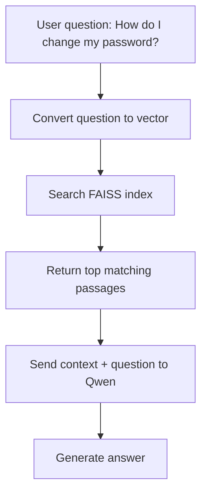
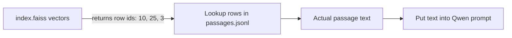
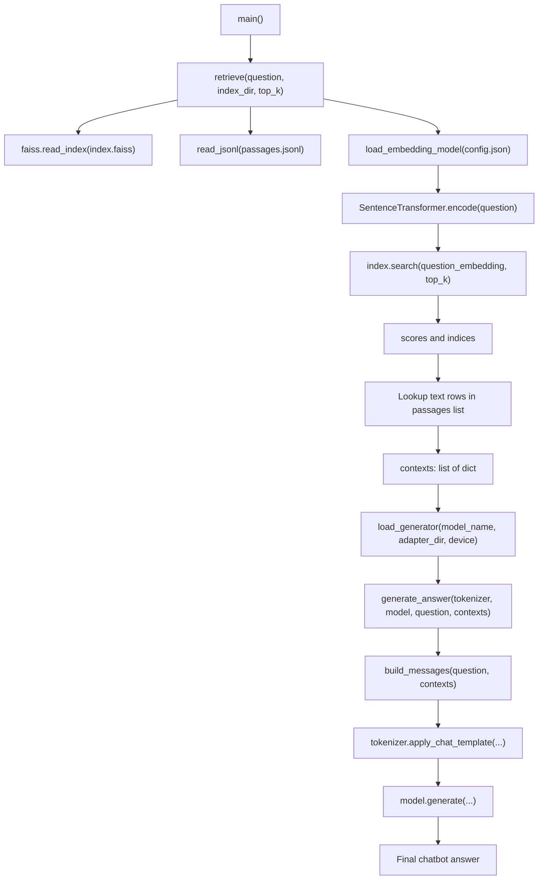
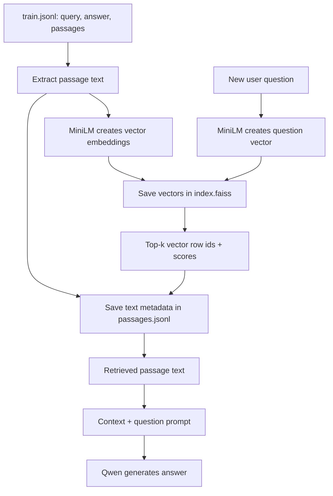

# What Is An Index In RAG?

In this project, an **index** is a fast searchable store of document vectors.

RAG means:

```text
Retrieval-Augmented Generation
```

Before Qwen answers a question, we first retrieve useful text passages. The index helps us find those passages quickly.

## Simple Idea

Imagine we have these customer-support passages:

| id | passage text |
|---:|---|
| 1 | Refunds are available within 7 days of purchase. |
| 2 | You can reset your password from account settings. |
| 3 | Shipping usually takes 3 to 5 business days. |

User asks:

```text
How do I change my password?
```

The index helps find passage `2` because it is closest in meaning.



## What Does The Index Contain?

The FAISS index does **not** store normal text directly.

It stores **vectors**, which are lists of numbers that represent meaning.

Example passage:

```text
You can reset your password from account settings.
```

Embedding vector example:

```python
[0.12, -0.04, 0.88, 0.31, ...]
```

In our project, `sentence-transformers/all-MiniLM-L6-v2` creates vectors with this type:

```python
numpy.ndarray
```

Shape example:

```python
(number_of_passages, embedding_dimension)
```

For MiniLM, the embedding dimension is usually:

```python
384
```

So if we index `5,000` passages:

```python
embeddings.shape == (5000, 384)
```

That means:

```text
5000 passages
384 numbers per passage
```

## Files Created By `build_rag_index.py`

When we run:

```bash
python examples/build_rag_index.py \
  --data dataset/msmarco-small/train.jsonl \
  --index-dir checkpoints/rag-index
```

It creates:

```text
checkpoints/rag-index/index.faiss
checkpoints/rag-index/passages.jsonl
checkpoints/rag-index/config.json
```

### `index.faiss`

This contains the vector index.

In this project, `build_rag_index.py` lets you choose one of three FAISS strategies:

```python
faiss.IndexHNSWFlat
faiss.IndexIVFFlat
faiss.IndexPQ
```

The default is:

```bash
--index-type hnsw
```

All three store or organize vectors like:

```python
[
    [0.12, -0.04, 0.88, ...],
    [0.09, 0.44, -0.21, ...],
    [0.77, -0.13, 0.10, ...],
]
```

The index does not store the original text. The original text lives in `passages.jsonl`.

## FAISS Strategy Options

### HNSW

HNSW means:

```text
Hierarchical Navigable Small World
```

It builds a graph between vectors. During search, FAISS walks through the graph to find nearby vectors quickly.

Use it with:

```bash
python examples/build_rag_index.py \
  --data dataset/msmarco-small/train.jsonl \
  --index-dir checkpoints/rag-index \
  --index-type hnsw
```

Conceptual FAISS type:

```python
faiss.IndexHNSWFlat
```

Good for:

- Learning vector search
- Medium-sized local RAG indexes
- Fast search without a separate clustering step

Important parameters:

```python
hnsw_m: int
hnsw_ef_construction: int
hnsw_ef_search: int
```

### IVF

IVF means:

```text
Inverted File Index
```

It first clusters vectors into groups. At search time, FAISS checks the most relevant clusters instead of every vector.

Use it with:

```bash
python examples/build_rag_index.py \
  --data dataset/msmarco-small/train.jsonl \
  --index-dir checkpoints/rag-index-ivf \
  --index-type ivf \
  --ivf-nlist 50
```

Conceptual FAISS type:

```python
faiss.IndexIVFFlat
```

Good for:

- Larger datasets
- Learning approximate search with clustering

Important parameter:

```python
ivf_nlist: int  # number of clusters
```

### PQ

PQ means:

```text
Product Quantization
```

It compresses vectors into smaller codes. This saves memory, but it needs training examples to learn the compression codebooks.

Use it with:

```bash
python examples/build_rag_index.py \
  --data dataset/msmarco-small/train.jsonl \
  --index-dir checkpoints/rag-index-pq \
  --index-type pq \
  --pq-m 48 \
  --pq-bits 8
```

Conceptual FAISS type:

```python
faiss.IndexPQ
```

Good for:

- Very large indexes
- Lower memory usage
- Studying compressed vector databases

Important parameters:

```python
pq_m: int     # number of subquantizers
pq_bits: int  # bits per compressed code
```

### `passages.jsonl`

This stores metadata for each vector.

Example:

```json
{
  "id": 0,
  "source_query_id": "12345",
  "source_query": "how do I reset password",
  "source_answer": "Go to account settings and choose reset password.",
  "passage_index": 0,
  "text": "You can reset your password from account settings.",
  "url": "https://example.com/password-help",
  "is_selected": 1
}
```

Important data types:

```python
id: int
source_query_id: str
source_query: str
source_answer: str
passage_index: int
text: str
url: str
is_selected: int
```

### `config.json`

This stores information needed to load the index correctly.

Example:

```json
{
  "embedding_model": "sentence-transformers/all-MiniLM-L6-v2",
  "embedding_dim": 384,
  "passages": 5000,
  "source_data": "dataset/msmarco-small/train.jsonl",
  "index_type": "hnsw",
  "metric": "inner_product",
  "normalized_embeddings": true
}
```

## Why We Need Both `index.faiss` And `passages.jsonl`

FAISS returns only vector positions.

Example:

```python
indices = [10, 25, 3]
scores = [0.91, 0.87, 0.82]
```

This means:

```text
The best matching vectors are at rows 10, 25, and 3.
```

But Qwen needs actual text, not vector row numbers.

So we use those indices to look up the text in `passages.jsonl`.



## Method Call Flow When Searching

When you ask a question in `rag_chat.py`, the search flow starts from `main()` and then moves through retrieval, prompt building, and answer generation.

Command example:

```bash
python examples/rag_chat.py \
  --index-dir examples/faiss/rag-index \
  --model-name Qwen/Qwen2.5-0.5B-Instruct \
  --question "How do I reset my password?"
```

High-level method flow:



Detailed call sequence:

```text
main()
  parse command-line arguments
  contexts = retrieve(question, index_dir, top_k)
    index = faiss.read_index("index.faiss")
    passages = read_jsonl("passages.jsonl")
    embedder = load_embedding_model("config.json")
      reads embedding_model from config.json
      creates SentenceTransformer(...)
    question_embedding = embedder.encode([question])
    scores, indices = index.search(question_embedding, top_k)
    contexts = passages[indices]
  tokenizer, model = load_generator(...)
  answer = generate_answer(tokenizer, model, question, contexts)
    messages = build_messages(question, contexts)
    prompt = tokenizer.apply_chat_template(messages)
    output_ids = model.generate(prompt tokens)
    answer = tokenizer.decode(output_ids)
```

## Data Types During Search

Input question:

```python
question: str
```

Example:

```python
"How do I reset my password?"
```

Loaded FAISS index:

```python
index: faiss.Index
```

Depending on how you built it, the real type can be:

```python
faiss.IndexHNSWFlat
faiss.IndexIVFFlat
faiss.IndexPQ
```

Loaded passage metadata:

```python
passages: list[dict[str, Any]]
```

Example passage metadata:

```python
{
    "id": 10,
    "text": "You can reset your password from account settings.",
    "url": "https://example.com/password-help",
    "is_selected": 1,
}
```

Question embedding:

```python
question_embedding: numpy.ndarray
```

Shape:

```python
(1, 384)
```

Meaning:

```text
1 question
384 numbers representing the question meaning
```

FAISS search result:

```python
scores: numpy.ndarray
indices: numpy.ndarray
```

Example:

```python
scores = [[0.91, 0.87, 0.82]]
indices = [[10, 25, 3]]
```

Meaning:

```text
Best passage is row 10
Second best passage is row 25
Third best passage is row 3
```

Retrieved contexts:

```python
contexts: list[dict[str, Any]]
```

Example:

```python
[
    {
        "id": 10,
        "text": "You can reset your password from account settings.",
        "score": 0.91,
    }
]
```

Prompt sent to Qwen:

```python
messages: list[dict[str, str]]
```

Example:

```python
[
    {
        "role": "system",
        "content": "You are a helpful customer-support assistant..."
    },
    {
        "role": "user",
        "content": "Retrieved context:\n[Context 1]\nYou can reset your password...\n\nQuestion: How do I reset my password?"
    }
]
```

Final output:

```python
answer: str
```

Example:

```text
You can reset your password from account settings.
```

## The Exact Search Line

The main FAISS search happens in this line inside `rag_chat.py`:

```python
scores, indices = index.search(query_embedding, top_k)
```

Inputs:

```python
query_embedding: numpy.ndarray  # shape: (1, 384)
top_k: int                      # example: 3
```

Outputs:

```python
scores: numpy.ndarray   # similarity scores
indices: numpy.ndarray  # row numbers in passages.jsonl
```

Then the code uses each returned row number to fetch the actual text:

```python
passage = passages[int(passage_index)].copy()
```

## Full Data Flow



## Tiny Python Example

This is not the full project code. It is just to understand the idea.

```python
passages = [
    "Refunds are available within 7 days.",
    "You can reset your password from account settings.",
    "Shipping takes 3 to 5 business days.",
]

# MiniLM turns each passage into a vector.
embeddings = model.encode(passages, normalize_embeddings=True)

# FAISS stores those vectors.
index = faiss.IndexFlatIP(384)
index.add(embeddings)

# User question also becomes a vector.
question = "How do I change my password?"
question_embedding = model.encode([question], normalize_embeddings=True)

# FAISS returns the closest passage ids.
scores, ids = index.search(question_embedding, k=1)

best_passage = passages[ids[0][0]]
print(best_passage)
```

Output:

```text
You can reset your password from account settings.
```

## Important Terms

**Passage**  
A small piece of text that can be retrieved.

**Embedding**  
A list of numbers representing the meaning of text.

**Vector**  
Another word for a list of numbers.

**Index**  
A searchable structure that stores vectors for fast similarity search.

**FAISS**  
The library we use to create and search the vector index.

**Top-k**  
The number of best matching passages to retrieve. For example, `top-k=3` returns the 3 closest passages.

**Similarity score**  
A number showing how close the question vector is to a passage vector. Higher is usually better in our setup.

## In One Sentence

The index is a fast lookup system that helps the chatbot find the most relevant text passages before Qwen generates an answer.
